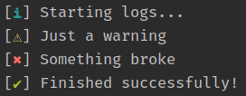

[![Tests][tests-badge]][tests-link]
[![Go Report Card][report-badge]][report-link]
[![Go Reference][reference-badge]][reference-link]
[![License][license-badge]][license-link]
[![Coverage][coverage-badge]][coverage-link]

# cligger

> Simple CLI logger with colored symbols
Includes fallbacks for Windows CMD which only supports a [limited character set](https://en.wikipedia.org/wiki/Code_page_437).


[](README.md)

## Install

```
$ go get github.com/guumaster/cligger
```

## Usage

### Basic example
```go

package main

import (
  "fmt"
  log "github.com/guumaster/cligger"
)

func main() {
    log.Success("Finished successfully!")
    log.Error("Something broke")

    // On good OSes:  ✔ Finished successfully!
    //                ✖ Something broke

    // On Windows:    √ Finished successfully!
    //                × Something broke
}

```

### Forcing colors

`cligger` will autodetect if its not in TTY mode and remove all colors. You can force color output with this example:

```go

  	log.EnableColors()
    log.Success('Finished successfully!')

    // Terminal Output:   ✔ Finished successfully!
    // Redirected Output: ^[[1;32m✔^[[0m Finished successfully!
```

### Create your own instance

`cligger` can work on Singleton mode or as an instance like this example:

```go
    logger := cligger.NewLogger()
    logger.Success('Finished successfully!')

    // Output:  ✔ Finished successfully!
```


### Change output writer

`cligger` defaults to `os.Stdout` but you can change it to any writer:

```go
	content := bytes.NewBufferString("")

	logger := NewLoggerWithWriter(b)
	logger.Success("Finished successfully!")
	fmt.Println(content.String())

	// Output:  ✔ Finished successfully!

    // or write to file:
	ioutil.WriteFile("/tmp/log.out", content, 0644)
```


## Related

- [guumaster/logsymbols](https://github.com/guumaster/logsymbols) - Colored symbols for various log levels


## Author(s)

* [guumaster](https://github.com/guumaster)

If you like this tool and think is worth it, you can invite me a coffee: 

[![paypal.me/guumaster][paypal-badge]][paypal-link]
[![ko-fi.com/guumaster][kofi-badge]][kofi-link]


## LICENSE

 [MIT license](LICENSE)


<!-- JUST BADGES & LINKS -->
[tests-badge]: https://img.shields.io/github/workflow/status/guumaster/cligger/Test
[tests-link]: https://github.com/guumaster/cligger/actions?query=workflow%3ATest

[report-badge]: https://goreportcard.com/badge/github.com/guumaster/cligger
[report-link]: https://goreportcard.com/report/github.com/guumaster/cligger

[reference-badge]: https://godoc.org/github.com/guumaster/cligger?status.svg
[reference-link]: https://pkg.go.dev/github.com/guumaster/cligger?tab=overview


[license-badge]: https://img.shields.io/github/license/guumaster/cligger
[license-link]: https://github.com/guumaster/cligger/blob/master/LICENSE

[coverage-badge]: https://sonarcloud.io/api/project_badges/measure?project=guumaster_cligger&metric=coverage
[coverage-link]: https://sonarcloud.io/dashboard?id=guumaster_cligger

[paypal-link]: https://www.paypal.me/guumaster
[paypal-badge]: https://img.shields.io/static/v1?label=donate&message=PayPal&color=00457C&logo=paypal

[kofi-link]: https://ko-fi.com/guumaster
[kofi-badge]: https://img.shields.io/static/v1?label=donate&message=Ko-fi&color=F16061&logo=ko-fi
